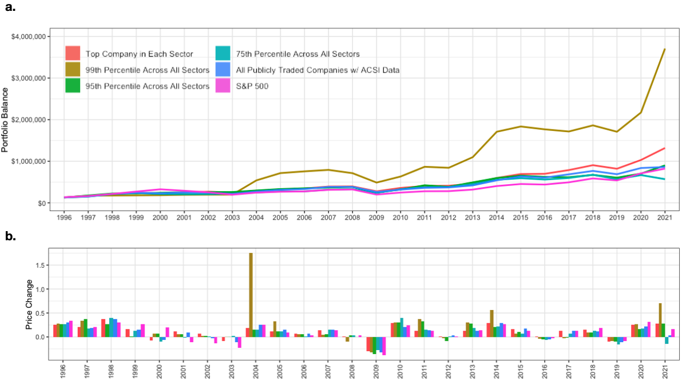

# ACSI Score Analysis for Investment Strategies

This repository contains the datasets, code, and analysis to replicate the research conducted on the use of American Customer Satisfaction Index (ACCSI) scores in investment strategies. This research explores the hypothesis of whether high ACSI scores can predict superior stock market returns.



## Repository Contents
Below is a brief explanation of the contents in this repository:

- ```acsi_analysis.Rmd```: An R markdown file containing the analysis of ACSI data.
- ```acsi_analysis.html```: The output from the R markdown file, knitted to an HTML document.
- ```get_stock_data.ipynb```: A Python notebook used to retrieve historical ticker data for all the stocks in the dataset.
- ```score_data.csv```: A CSV file containing score data for all companies with ACSI data that are publicly traded.
- ```sp_500_stock_df.csv```: A CSV file containing stock data for the S&P 500.
- ```ACSI_Scores/```: A directory containing raw ACSI scores and modified/annotated versions of these scores.
- ```archive/```: A directory containing miscellaneous files used during the development of this project.
Research Summary
The motivation for this research was to test the effectiveness of using American Customer Satisfaction Index (ACSI) scores as a basis for investment strategies. The study analyzed the performance of these strategies from 1996 to 2021 against the S&P 500, focusing particularly on strategies that selected the top company in each sector and the top 1% of companies across all sectors.

Our analysis revealed a decline in the success rates of these strategies in outperforming the market in recent years. For more detailed findings, refer to the complete analysis in acsi_analysis.html.

## Data & Methods
Consumer satisfaction scores from 1996 to 2021 for various companies were collected from the ACSI website in 2021. Each company had an associated sector (e.g., Soft Drinks, Apparel, Hotels, etc.). The ACSI dataset was manually annotated to identify if each company was publicly listed and, if so, what the company’s ticker was. After annotation, the yfinance python package was used to download annual stock data.

The data used in this analysis, including the ACSI data up to 2021 and the accompanying analysis code, can be found in this repository. Of the 564 company entries in the dataset with ACSI scores, 318 were publicly traded and had tickers. Some tickers encompassed multiple brands/companies leading to a total of 235 unique tickers.

## Disclaimer
The information provided in this article is for educational and informational purposes only and should not be construed as financial or investment advice. The author and the publisher are not financial advisors or professionals and do not claim to be providing personalized financial advice. The article is based on the author's research and analysis, and the results reported may not be applicable to individual circumstances. Before making any financial decisions or investments, readers should consult with a financial advisor or professional to consider their specific situation, goals, and risk tolerance. Past performance is not indicative of future results, and no representation or warranty is made regarding the accuracy or completeness of the information provided.
